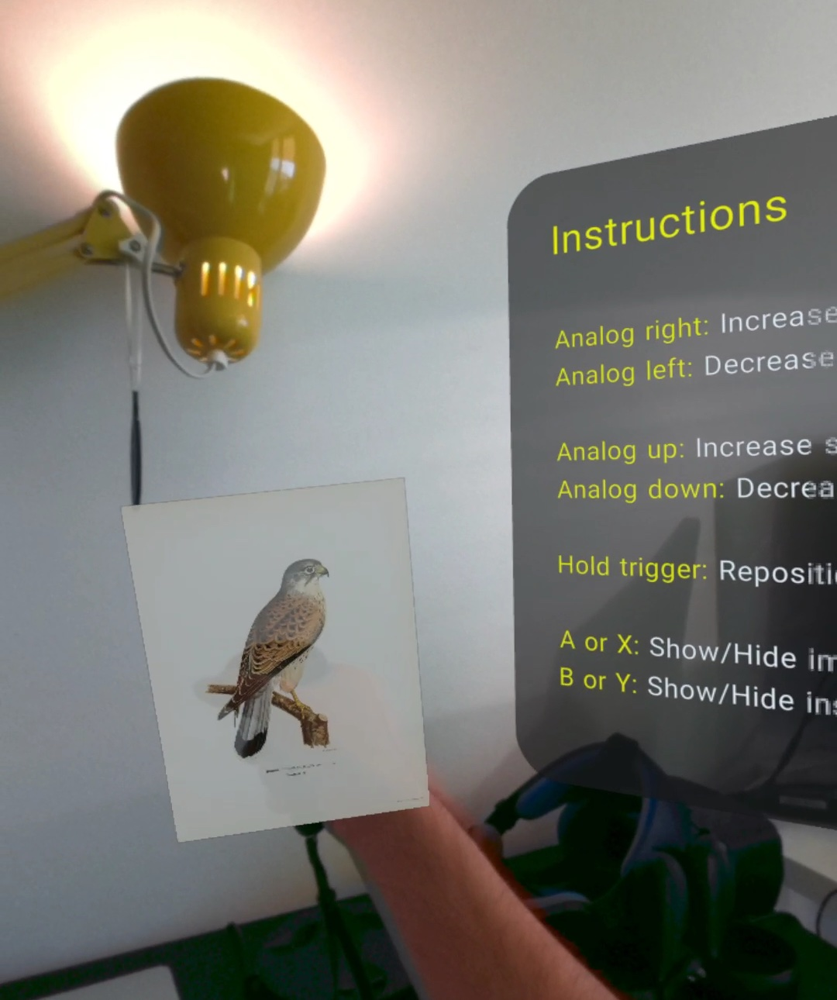
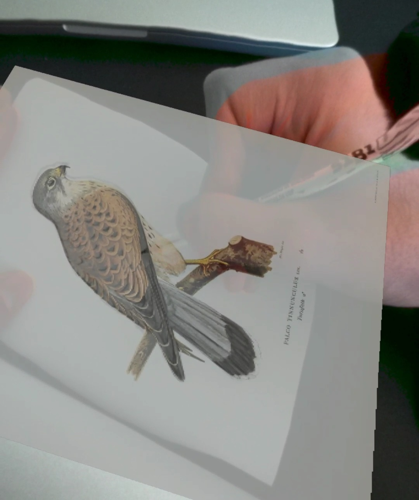
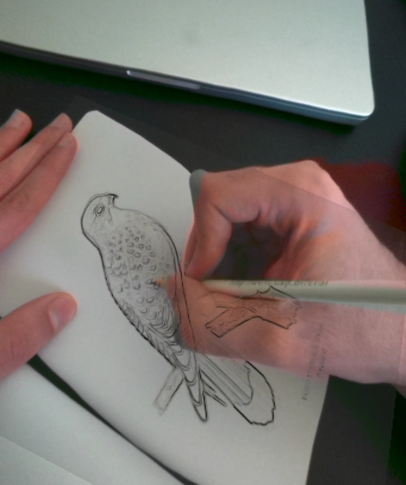
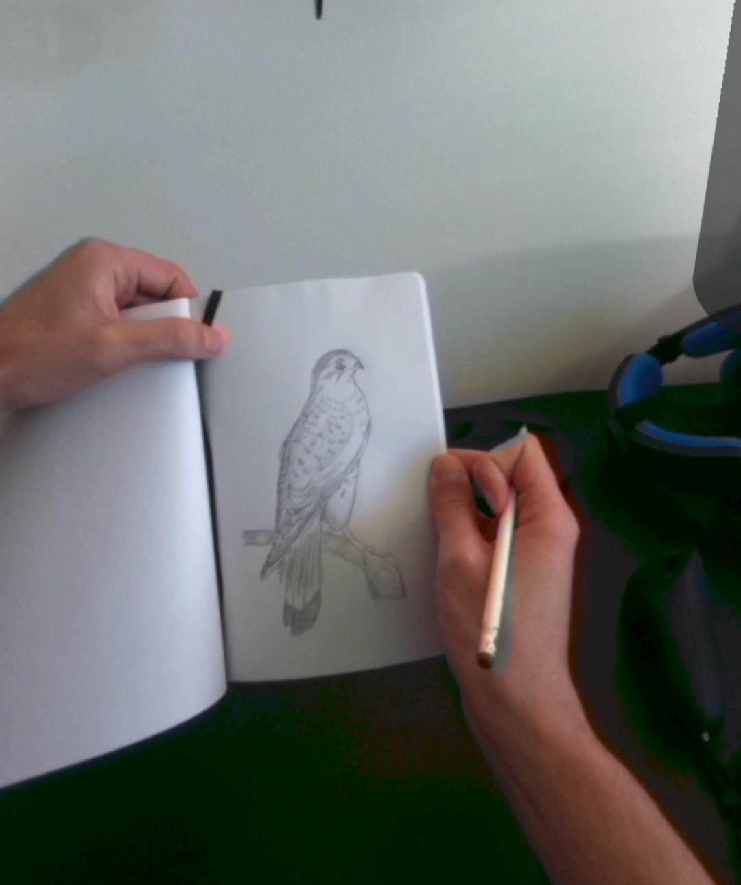

# Passtracing

**Drawing/tracing projector in Augmented Reality (Passthrough)**

This is a simple [WebXR](https://immersiveweb.dev) app built with [three.js](https://threejs.org) and [three-mesh-ui](https://felixmariotto.github.io/three-mesh-ui/) that lets you use your Meta Quest 2 and Meta Quest Pro to draw/trace on top of virtual images in Augmented Reality.

Inspired by [Easely](https://github.com/RalphVR/easely-meta-hackathon) and [Contour](https://sidequestvr.com/app/6643/contour-demo).

## Screenshots

## Requirements

Meta Quest 2 or Meta Quest Pro.

## Instructions

[Video](https://vm.tiktok.com/ZMFn8E64G/)

1. Navigate to [fabio914.github.io/passtracing](https://fabio914.github.io/passtracing) with your PC.

2. Copy an image URL and paste on the text field. For example, a public domain image from [rawpixel](https://www.rawpixel.com/public-domain).

3. Click on "Load image" to reload the page with this image, or click on "Send link to Meta Quest" to send this to your Meta Quest 2 or Meta Quest Pro.

4. After opening the link on your Meta Quest 2 or Meta Quest Pro, click on "Start AR" to start.

5. Use the thumbsticks (analog sticks) to control the opacity and size of the image. Hold the trigger button to position the image on top of a sheet of paper.

6. Draw/Trace.

